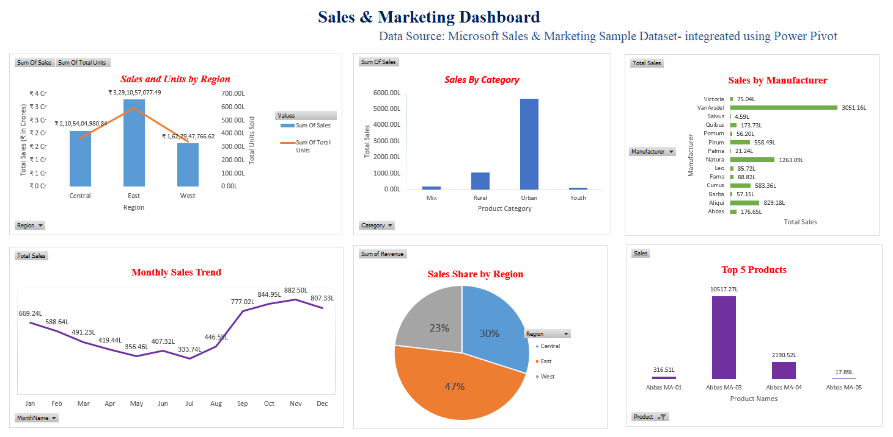

# Executive Sales Performance Dashboard

## 🎯 Business Objective
The goal of this project was to analyze a global sales dataset to identify top-performing regions, manufacturers, and product categories. By visualizing $7.02 Billion in revenue, this dashboard helps stakeholders make data-driven decisions regarding inventory and regional marketing spend.

## 📊 Dashboard Preview

## 📊 Key Insights from the Analysis
* **Top Region:** The **East** region is the primary revenue driver, contributing **$3.29B (approx. 47%)** of total sales.
* **Dominant Category:** **Urban** products significantly outperform other categories, accounting for **$5.63B** in revenue.
* **Market Leader:** **VanArsdel** holds the largest market share among manufacturers with **$3.05B** in total sales.
* **Sales Trends:** Analysis shows a significant revenue peak in the last quarter (Oct-Dec), with November reaching **$882M**.

## 🛠️ Technical Skills Demonstrated
* **Data Modeling:** Used **Power Pivot** to create relationships between multiple data tables.
* **Advanced Formulas:** Implemented DAX/Excel formulas for **YTD (Year-To-Date)** and **SPLY (Same Period Last Year)** comparisons.
* **User Experience:** Created interactive Slicers (Timeline, Region, Category) for on-the-fly data filtering.
* **Visual Hierarchy:** Organized KPIs (Total Units, Total Sales) at the top for immediate executive summary.
